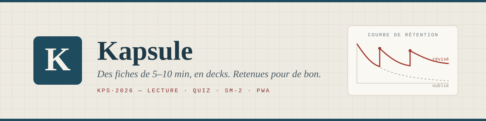
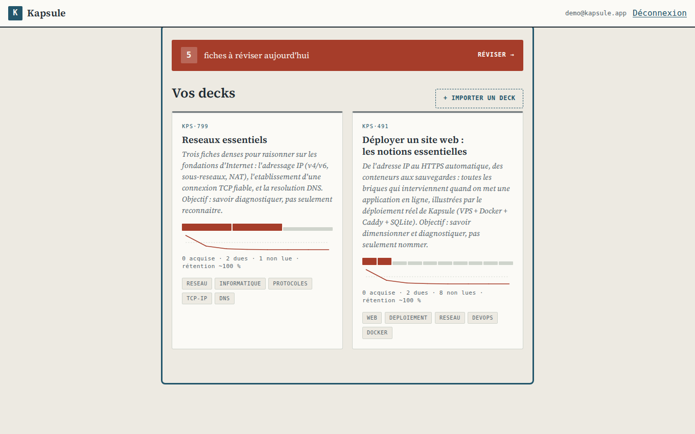
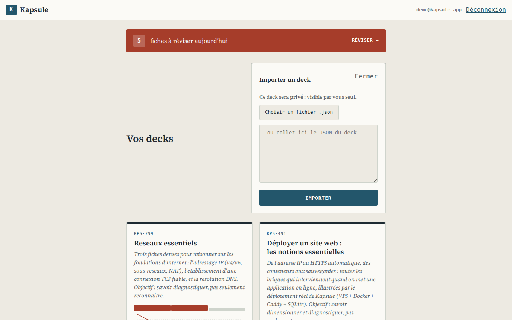
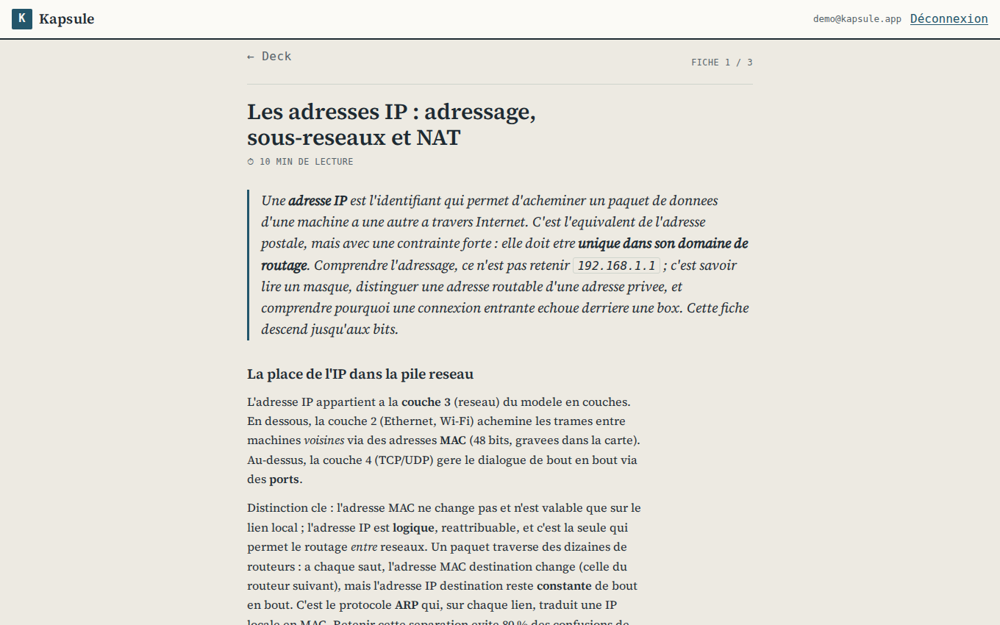
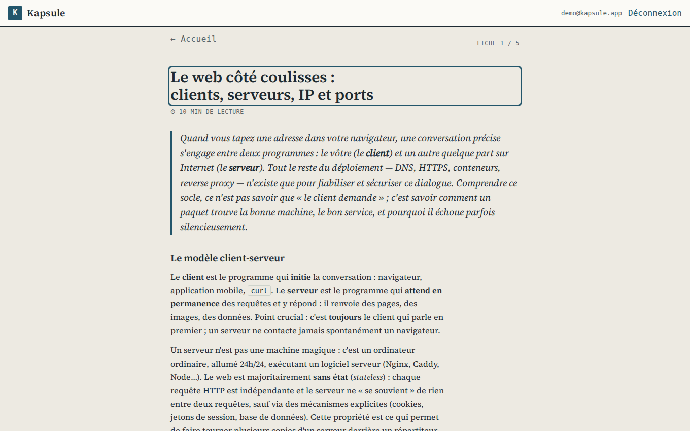
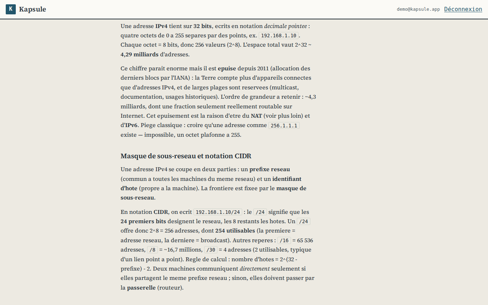
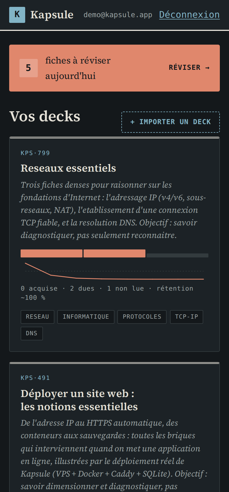

<p align="center">
  
</p>

<p align="center">
  <a href="https://github.com/Jilanos/Kapsule/actions/workflows/ci.yml"></a>
  <a href="https://github.com/Jilanos/Kapsule/actions/workflows/codeql.yml"></a>
  <a href="LICENSE"></a>
  
  
</p>

**Kapsule** est une visionneuse de **fiches de connaissance courtes** (5–10 min)
organisées en **decks** : lecture structurée, quiz, puis **répétition espacée
(SM-2)** pour transformer une lecture d'aujourd'hui en savoir durable. C'est une
**PWA** installable — mobile comme ordinateur, thème clair/sombre automatique.

<p align="center">
  
</p>

## Ajouter un deck ? 30 secondes.

Le contenu suit un **format JSON prédéfini** ([`SPEC.md`](SPEC.md)) que des
**agents IA peuvent produire directement** : donnez `SPEC.md` comme consignes à
votre agent préféré (« fais-moi un deck sur les réseaux »), collez le JSON dans
l'UI — c'est tout. Le deck est **validé contre un contrat strict**
(jusqu'à 200 fiches/deck) : un JSON accepté s'affiche toujours correctement.

<p align="center">
  
</p>

- **Fichier ou copier-coller** : `.json` ou collage direct, import instantané.
- **Validation à l'entrée** : erreurs expliquées champ par champ, jamais de deck cassé.
- **Aussi par API** : `POST /api/decks` pour automatiser l'import.
- **Vérifiable en CLI** : `npm run validate-deck -- decks/reseaux-essentiels.json`.

## Apprendre au quotidien

Chaque fiche se lit comme une page de **cahier de laboratoire** : intro,
concepts, exemples, points clés, puis un **quiz** dont le score alimente la
planification SM-2. Kapsule vous rappelle **quoi réviser, et quand** — la vue
« Révisions du jour » regroupe les fiches dues, tous decks confondus, et la
**courbe de rétention** de chaque deck montre ce que votre mémoire retient.

|                                                 Lecture structurée                                                  |                                                   Révisions du jour                                                    |
| :-----------------------------------------------------------------------------------------------------------------: | :--------------------------------------------------------------------------------------------------------------------: |
|  |  |

<table align="center">
  <tr>
    <td width="62%"></td>
    <td width="38%"></td>
  </tr>
  <tr>
    <td align="center"><em>Du contenu dense et lisible — ici le deck « Réseaux essentiels »</em></td>
    <td align="center"><em>Sur mobile, thème sombre automatique</em></td>
  </tr>
</table>

- **Des sessions courtes** : 5–10 min par fiche, pensées pour un rituel quotidien.
- **La bonne fiche au bon moment** : SM-2 replanifie chaque fiche selon votre score de quiz.
- **Une progression visible** : fiches acquises, fiches dues, rétention estimée par deck.
- **Partout** : PWA installable, progression synchronisée entre vos appareils.

## Fonctionnalités

- **Decks & fiches** : import par JSON validé contre un contrat strict
  (jusqu'à 200 fiches/deck), lecture structurée (intro, concepts, exemples,
  points clés, quiz).
- **Comptes multi-appareils** : inscription / connexion par email + mot de passe,
  sessions par appareil révocables (voir Sécurité).
- **Rôles & visibilité** : `guest` / `master` / `admin` ; decks `private`,
  `general`, `master`. Toute route liée à un deck applique la même décision
  d'autorisation.
- **Console d'administration** (`/admin`, rôle `admin`) : comptes et rôles,
  inspection des contenus, aperçu du stockage, journal d'audit
  (voir [Administrer Kapsule](#administrer-kapsule)).
- **Progression** cloisonnée par utilisateur.
- **Répétition espacée (SM-2)** : la note dérive du score de quiz ; vue
  « Révisions du jour » multi-decks.
- **Hors ligne** : le shell de l'app est pré-caché. Les **réponses d'API
  authentifiées ne sont pas mises en cache** (isolation inter-comptes) ; la
  lecture hors ligne segmentée par utilisateur est un chantier suivi
  (voir [ADR 003](logics/architecture/adr_003_kapsule_durcissement_assets_prives_cache_pwa_et_sessions.md)).

## Structure du monorepo

```
packages/schema   Contrat de contenu : JSON Schema + validateur partagé
apps/backend      API REST (Node + Express + SQLite) : auth, decks, fiches, progression, SM-2, import
apps/frontend     PWA React + Vite : lecteur, decks, progression, révision
decks/            Decks d'exemple / seed
SPEC.md           Consignes de format pour humains et agents IA
```

## Prérequis

- **Node.js ≥ 20** et **npm** (monorepo npm workspaces).

## Démarrer

```bash
npm ci
npm run dev:backend      # API sur http://localhost:3001
npm run dev:frontend     # PWA sur http://localhost:5173 (proxy /api -> backend)
```

## Vérifier (comme la CI)

```bash
npm test                 # tests de tous les workspaces (schéma, backend, smoke frontend)
npm run build            # build de production
npm run format:check     # style Prettier
npm run budget           # budget de performance du bundle (après build)
npm audit --omit=dev     # aucune vulnérabilité de production
npm run validate-deck -- decks/reseaux-essentiels.json
```

## Configuration (variables d'environnement)

| Variable               | Rôle                                                                 | Défaut                    |
| ---------------------- | -------------------------------------------------------------------- | ------------------------- |
| `PORT`                 | Port d'écoute de l'API                                               | `3001`                    |
| `KAPSULE_DB`           | Chemin du fichier SQLite                                             | local `apps/backend`      |
| `KAPSULE_UPLOADS`      | Dossier des assets d'images de decks                                 | local `apps/backend`      |
| `KAPSULE_REGISTRATION` | `open` / `closed` — **fermée par défaut** si `NODE_ENV=production`   | selon environnement       |
| `KAPSULE_ASSET_SECRET` | Secret HMAC de signature des URLs d'assets (**obligatoire** en prod) | —                         |
| `KAPSULE_BACKUP_DIR`   | Dossier des sauvegardes (mesuré par l'aperçu de stockage admin)      | `<KAPSULE_DB>/../backups` |

Les variables et secrets de production sont documentes dans le repo
[`paulmondou-infra`](https://github.com/Jilanos/paulmondou-infra), qui porte le
Compose VPS et les fichiers Caddy.

## Architecture (résumé)

- **Backend** : Express + SQLite (`better-sqlite3`), migrations versionnées.
  Couches séparées — schéma (`packages/schema`), stockage (`store.mjs`),
  autorisations pures (`permissions.mjs`), auth/sessions (`auth.mjs`), routes
  (`app.mjs`). Un seul conteneur sert l'API et la PWA buildée en production.
- **Frontend** : React + React Router + Vite (PWA via `vite-plugin-pwa`).
- **Décisions d'architecture** : voir `logics/architecture/` (ADR 001–003).

## Administrer Kapsule

La console `/admin` remplace les interventions SQL ponctuelles en production.
Elle est réservée au rôle `admin` : chaque route `/api/admin/*` vérifie la
session côté serveur et répond `403` à un `guest` ou un `master`, y compris en
appel direct. Le masquage de l'entrée de menu n'est qu'un confort.

**Premier administrateur.** Aucune route ne crée d'admin : le premier doit être
promu en base, une seule fois.

```bash
sqlite3 "$KAPSULE_DB" \
  "UPDATE users SET role='admin' WHERE email='vous@exemple.fr';"
```

Ensuite, tout se fait depuis la console.

**Ce que la console permet.**

| Onglet   | Contenu                                                                     |
| -------- | --------------------------------------------------------------------------- |
| Comptes  | Recherche par email, rôles, activité, compteurs de contenus, suppression    |
| Contenus | Decks avec propriétaire, visibilité, fiches, volumes, lecteurs, suppression |
| Stockage | Tailles agrégées (base, images, sauvegardes) et compteurs de données        |
| Journal  | Trace en lecture seule des actions sensibles                                |

**Garde-fous.** Ils sont appliqués par le serveur, pas par l'interface :

- le **dernier administrateur** ne peut être ni rétrogradé ni supprimé ;
- personne ne modifie son propre rôle ni ne supprime son propre compte ;
- toute suppression exige de **retaper l'identifiant** de la cible, après
  affichage de son impact ;
- chaque changement de rôle, de visibilité et chaque suppression produit une
  entrée d'audit (acteur, cible, avant/après, horodatage). Aucun secret n'y est
  consigné, et l'API n'expose aucune écriture sur ce journal.

**Politique de suppression d'un compte** — transactionnelle et documentée :

- sessions, progression et révisions du compte : **supprimées** ;
- ses decks **privés** : supprimés avec leurs fiches et leurs images ;
- ses decks **partagés** (`general`, `master`) : **conservés** et rattachés à
  « sans propriétaire ». Supprimer du contenu collectif ne doit pas être un
  effet de bord de la suppression d'un compte.

**Politique de suppression d'un deck** : fiches, progression et révisions de
tous les lecteurs partent avec lui. L'écran annonce le nombre de comptes
affectés avant confirmation.

**Limites de l'aperçu de stockage.** Il mesure uniquement le volume Kapsule :
fichier SQLite (et ses journaux WAL), dossier d'images, dossier de sauvegardes.
Il ne renvoie ni chemin, ni nom de fichier, ni contenu, et ne permet aucun
téléchargement. Une catégorie non montée est affichée **« indisponible »** —
jamais `0`, qui laisserait croire à un volume mesuré et vide. Les volumes des
autres applications et de l'hôte Docker sont hors périmètre.

**Ce que la console n'est pas** : ni console SQL, ni éditeur de colonnes brutes,
ni portail transverse aux autres applications, ni explorateur de fichiers.

## Sécurité

- Mots de passe hachés (`scrypt`, sel par utilisateur), hachage asynchrone.
- Sessions par token opaque en `Authorization: Bearer`, purge des sessions
  expirées, écritures de session throttlées.
- Rate limiting sur `login`/`register`, bornage des entrées.
- Assets d'images de decks servis par **URL signée** à durée de vie courte.
- Console d'administration gardée côté serveur, mutations sensibles auditées et
  projections allowlistées (ni hash, ni token, ni chemin absolu en réponse).
- En production : conteneur non-root, en-têtes CSP/HSTS via Caddy, inscription
  fermée par défaut.
- CI : tests, build, audit des dépendances, scan de secrets (gitleaks), CodeQL,
  scan d'image (Trivy).

Signalement de vulnérabilités : voir [`SECURITY.md`](SECURITY.md).

## Déploiement

Ce repo fournit l'image applicative Kapsule via le `Dockerfile` racine. Le VPS,
Caddy, les sites statiques, les sauvegardes et les scripts d'exploitation
vivent dans [`paulmondou-infra`](https://github.com/Jilanos/paulmondou-infra).

## Générer des fiches avec une IA

Donner [`SPEC.md`](SPEC.md) comme consignes à un agent, puis importer le JSON
produit via l'UI ou l'API. Voir la section « Prompt type » de `SPEC.md`.

## Limites connues

- Lecture hors ligne des decks désactivée tant que le cache segmenté par
  utilisateur n'est pas livré (choix d'isolation, ADR 003).
- Pas de recherche / tri / pagination pour de très grandes bibliothèques.
- Administration des rôles par accès direct à la base (pas d'UI dédiée).
- Stockage SQLite mono-instance (pas de montée en charge multi-nœuds).

## Licence

[MIT](LICENSE).
