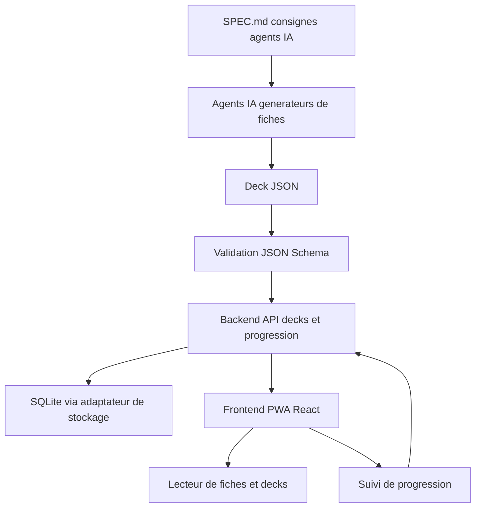

## adr_001_kapsule_architecture_direction - Kapsule architecture direction
> Date: 2026-07-17
> Status: Accepted
> Drivers: contrat de contenu ferme, generation de fiches par agents IA, PWA installable Android, backend leger des le MVP
> Related request: `req_000_cadrer_et_creer_le_mvp_kapsule`
> Related backlog: `item_001_definir_le_schema_de_fiche_et_le_spec_md_pour_agents_ia`, `item_002_creer_le_socle_monorepo_pwa_frontend_et_backend_api`, `item_003_construire_le_lecteur_de_fiches_et_la_navigation_en_deck`, `item_004_suivre_la_progression_et_la_persister_via_le_backend`, `item_005_importer_et_valider_des_decks_generes_par_ia`
> Related task: `task_001_orchestrer_le_mvp_kapsule`
> Reminder: Update status, linked refs, decision rationale, consequences, and follow-up work when you edit this doc.

# Overview
Cet ADR fixe la direction d'architecture initiale de Kapsule : une visionneuse de fiches de connaissance courtes (5-10 min) organisees en decks. Le coeur du systeme est un contrat de contenu (JSON Schema + SPEC.md) qui permet a des agents IA de produire des decks importables sans retouche, avec un rendu toujours coherent. Le frontend est une PWA installable sur Android ; un backend leger porte des le MVP le stockage des decks et la progression.

# Context
- Projet neuf, aucun code existant ; l'utilisateur veut des fiches courtes (5-10 min), des decks, un suivi parcourues/apprises et un enchainement fluide.
- Le format predefini est le differenciateur : des agents IA doivent pouvoir generer des decks a partir d'un fichier de consignes et le resultat doit s'importer directement.
- Cible d'usage : navigateur desktop et Android ; l'utilisateur veut eviter la friction d'une appli native au MVP.
- L'utilisateur veut un backend tres tot pour eviter les frictions (progression multi-appareils, stockage centralise des decks).
- Les fiches peuvent contenir des images et un quiz optionnel de fin de fiche.

# Decision
- Le contrat de contenu est la fondation : JSON Schema (deck + fiche) avec un ensemble ferme de types de sections (`intro`, `concept`, `example`, `takeaways`, `quiz`) ; toute fiche est validee a l'import et rejetee avec des erreurs claires sinon.
- SPEC.md documente le format et les consignes pedagogiques ; il sert a la fois de doc humaine et de prompt pour les agents IA.
- Frontend : PWA React + Vite (manifest, service worker) — installable sur Android sans store, lecture hors-ligne des decks deja charges.
- Backend : Node leger (API REST) present des le MVP pour decks, fiches, progression ; utilisateur unique simple au depart (pas d'auth multi-comptes complexe).
- Persistance : SQLite derriere une frontiere d'adaptateur de stockage, pour pouvoir evoluer vers Postgres ou une synchro plus riche sans refonte.
- Structure : monorepo (frontend + backend + schema partage), le schema JSON etant un paquet commun consomme par les deux cotes.
- Les images des fiches sont referencees par les fiches et servies par le backend (upload avec le deck).

# Consequences
- L'app ne rend que du contenu valide : zero CSS par fiche, rendu garanti, et la production de contenu se fait entierement hors app via des agents IA.
- Le schema devient une surface de compatibilite : tout changement de format devra etre versionne (champ `version` dans le deck) pour ne pas casser les decks existants.
- Le backend des le MVP ajoute un cout d'infrastructure (hebergement, sauvegarde) mais supprime les frictions de synchro et de partage de decks.
- La PWA couvre Android ; iOS reste possible mais avec des limites PWA connues (notifications, stockage).
- La repetition espacee (SM-2) pourra s'appuyer plus tard sur la progression deja persistee cote backend.

# Requirements
- Valider deck et fiches via JSON Schema a l'import (UI et API) avec rapport d'erreurs exploitable.
- Rendre les sections typees : intro, concept (avec heading et image optionnelle), example, takeaways, quiz.
- Gerer les decks : liste, ouverture, etat des fiches (non vue / vue / apprise), enchainement vers la fiche suivante.
- Persister la progression cote backend et la restaurer au chargement.
- Servir les images referencees par les fiches.
- Installer l'app en PWA sur Android et permettre la lecture hors-ligne des decks charges.
- Fournir un deck d'exemple valide servant de fixture et de reference pour SPEC.md.

# Data model draft
- `Deck`: id, slug, titre, description, tags, version du schema, date d'import.
- `Card`: deck, id, titre, duree estimee, niveau, ordre dans le deck, sections (JSON valide).
- `Section`: type ferme (intro, concept, example, takeaways, quiz), contenu, heading optionnel, image optionnelle.
- `QuizQuestion`: question, choix, index de la bonne reponse, explication optionnelle.
- `Progress`: utilisateur, fiche, etat (non vue / vue / apprise), horodatages, score de quiz optionnel.
- `Asset`: deck, chemin relatif, type MIME, contenu binaire.

# First implementation slice
- Definir le JSON Schema deck/fiche et rediger SPEC.md.
- Creer le deck d'exemple et le validateur avec tests.
- Scaffolder le monorepo : frontend React+Vite PWA, backend Node + SQLite.
- API REST minimale : decks, fiches, progression, import.
- Lecteur de fiches sur le deck d'exemple + vue deck avec etats.
- Import de deck par UI et API avec validation.

# Risks
- Un ensemble de types de sections trop pauvre poussera les agents IA a tordre le contenu ; prevoir une extension versionnee du schema.
- Les decks generes par IA peuvent etre structurellement valides mais pedagogiquement faibles : SPEC.md doit porter les consignes de qualite, pas seulement le format.
- La gestion des images (taille, formats, references cassees) est une source classique de friction a l'import.
- Le hors-ligne PWA (service worker + cache des decks) peut introduire des incoherences de progression si mal synchronise avec le backend.

# References
- Related request: `req_000_cadrer_et_creer_le_mvp_kapsule`
- Related product: `prod_001_kapsule_product_brief`
- Related task: `task_001_orchestrer_le_mvp_kapsule`
