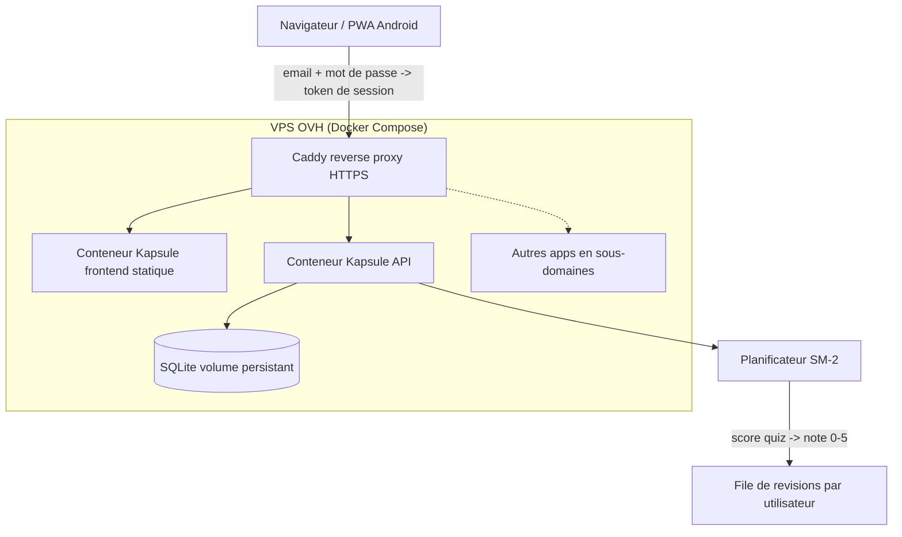

## adr_002_kapsule_evolution_v0_2_auth_sm2_deploiement - Kapsule v0.2 : auth multi-appareils, repetition espacee, deploiement
> Date: 2026-07-17
> Status: Accepted
> Drivers: progression multi-appareils reelle, apprentissage durable (retention), mise en ligne du service
> Related request: `req_001_authentification_multi_appareils`, `req_002_repetition_espacee_sm2`, `req_003_deploiement_vps_ovh`
> Related backlog: (none yet — grooming au lancement de chaque chantier)
> Related task: (none yet)
> Related product: `prod_001_kapsule_product_brief`
> Reminder: Update status, linked refs, decision rationale, consequences, and follow-up work when you edit this doc.

# Overview
Cet ADR fixe les directions d'architecture des trois evolutions v0.2 de Kapsule apres le MVP : une authentification multi-appareils reelle (le MVP utilise un utilisateur unique `default`), une repetition espacee SM-2 alimentee par les scores de quiz, et le deploiement sur un VPS OVH mutualisable avec les autres projets de l'operateur.

# Context
- Le MVP persiste la progression cote backend mais sous un utilisateur unique `default` : aucun isolement ni synchronisation reelle entre personnes/appareils.
- Les fiches terminent par un quiz note ; ce score est deja stocke (`progress.quiz_score`) et peut alimenter un algorithme de retention sans geste supplementaire.
- L'operateur possede plusieurs projets (cashflow-lab, F1_datas, week-summarizer...) et souhaite un hebergement mutualisable ; choix arrete : VPS OVH plutot que PaaS (cout fixe, multi-apps, SQLite natif).
- L'app est une PWA : les tokens de session doivent survivre au mode hors-ligne et la synchro de progression doit tolerer les reconnexions.

# Decision
## Authentification (req_001)
- Email + mot de passe, geres en propre (pas de service tiers) : hachage `scrypt` (module natif Node, zero dependance) avec sel par utilisateur.
- Sessions par token opaque aleatoire stocke en base (table `sessions`), transmis en `Authorization: Bearer` ; pas de JWT (revocation simple, zero secret a gerer).
- Duree de session longue (90 jours, renouvelee a l'usage) : adapte a une app d'apprentissage personnelle multi-appareils.
- Toutes les donnees de progression deviennent cloisonnees par `user_id` ; les decks restent partages entre utilisateurs (bibliotheque commune).
- Migration : les progressions `default` existantes sont rattachees au premier compte cree.
- Pas de verification d'email ni de reset de mot de passe au depart (suivi en follow-up) ; l'inscription peut etre fermee par variable d'environnement (`KAPSULE_REGISTRATION=closed`) une fois les comptes du foyer crees.

## Repetition espacee SM-2 (req_002)
- Algorithme SM-2 classique par (utilisateur, fiche) : `easiness`, `interval`, `repetitions`, `due_date` stockes dans une table `reviews`.
- La note SM-2 (0-5) derive automatiquement du score de quiz : ratio bonnes reponses -> note (1.0 -> 5 ; 0 -> 1) ; fiches sans quiz : relecture complete = note 4 par defaut.
- Une fiche entre dans le cycle de revision quand elle passe a l'etat `learned`.
- Nouvelle vue "Revisions du jour" agregee multi-decks : fiches dont `due_date <= aujourd'hui`, tri par anciennete d'echeance.
- Pas de notifications push au depart (follow-up) : le compteur de fiches dues suffit dans l'UI.

## Deploiement (req_003)
- VPS OVH sous Debian/Ubuntu, orchestration `docker compose` : un conteneur API Node, le frontend build servi en statique, Caddy en reverse proxy avec HTTPS automatique (Let's Encrypt).
- Caddy route par sous-domaine et reste extensible aux autres projets de l'operateur sur la meme machine.
- SQLite sur volume Docker persistant ; sauvegarde quotidienne par `sqlite3 .backup` + rotation (cron sur l'hote).
- Deploiement par script (`deploy.sh` : build image, push ou pull git, `docker compose up -d`) ; CI complete en follow-up.
- Durcissement de base : firewall (ufw), SSH par cle uniquement, mises a jour de securite automatiques (unattended-upgrades).

# Consequences
- Le backend passe de "stockage naif" a service authentifie : toutes les routes de progression exigent une session ; les routes decks restent en lecture publique pour les utilisateurs connectes.
- Le schema SQLite evolue (tables `users`, `sessions`, `reviews` ; `user_id` reel dans `progress`) : premiere vraie migration de base — introduire un mecanisme de migrations versionnees simple.
- SM-2 s'appuie sur le score de quiz existant : aucune friction UX ajoutee, mais la qualite de la planification depend de la presence de quiz dans les decks (SPEC.md les recommande deja).
- Un VPS unique mutualise les couts mais concentre les pannes : les sauvegardes hors-machine (rclone vers un stockage distant) deviennent le vrai filet de securite.
- L'operateur assume le role d'admin systeme (~1h de setup scripte, maintenance quasi nulle ensuite).

# Requirements
- Inscription, connexion, deconnexion par email + mot de passe ; token de session par appareil, revocable.
- Progression et revisions cloisonnees par utilisateur ; migration des donnees `default`.
- Table `reviews` SM-2 et recalcul de l'echeance a chaque revision notee par le score de quiz.
- Vue "Revisions du jour" multi-decks avec compteur de fiches dues.
- `Dockerfile` (API + build frontend), `docker-compose.yml` (app + Caddy), `Caddyfile` par sous-domaine.
- Script de deploiement et script de sauvegarde SQLite avec rotation.
- Documentation d'exploitation (README deploy : provision VPS, DNS, premiere mise en ligne, restauration backup).

# Data model draft
- `User`: id, email (unique), password_hash (scrypt), created_at.
- `Session`: token (aleatoire), user_id, created_at, last_used_at, expires_at, user_agent.
- `Review`: user_id, deck_id, card_id, easiness, interval_days, repetitions, due_date, last_grade, updated_at.
- `Progress` (existant) : user_id devient une vraie cle vers `users`.

# Risks
- Auth maison : surface d'erreur crypto/sessions — mitigee par scrypt natif, tokens opaques et tests dedies ; pas de JWT ni de crypto custom.
- Migration `default` -> premier compte : a tester sur copie de base avant application.
- SM-2 avec peu de quiz par deck degrade la qualite de planification — SPEC.md recommande deja 1 quiz/fiche ; la note par defaut (4) reste conservatrice.
- Hors-ligne PWA + sessions : un token expire pendant une longue periode hors-ligne doit re-demander la connexion sans perdre la progression locale (file d'attente de synchro).

# References
- ADR precedent : `adr_001_kapsule_architecture_direction`
- Requests : `req_001_authentification_multi_appareils`, `req_002_repetition_espacee_sm2`, `req_003_deploiement_vps_ovh`
