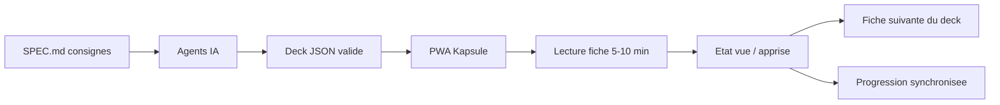

## prod_001_kapsule_product_brief - Kapsule product brief
> Date: 2026-07-19
> Status: Settled
> Related request: `req_008_ameliorer_l_exploration_et_l_affichage_des_decks`
> Related backlog: `item_013_ameliorer_l_exploration_et_l_affichage_des_decks`
> Related task: `task_009_ameliorer_l_exploration_et_l_affichage_des_decks`
> Related architecture: `adr_001_kapsule_architecture_direction`, `adr_002_kapsule_evolution_v0_2_auth_sm2_deploiement`, `adr_003_kapsule_durcissement_assets_prives_cache_pwa_et_sessions`
> Reminder: Update status, linked refs, scope, decisions, success signals, and open questions when you edit this doc.

# Overview
Kapsule est une visionneuse de fiches de connaissance courtes (5-10 min) organisees en decks, alimentee par un format JSON predefini que des agents IA peuvent produire directement, avec suivi de progression synchronise via un backend leger.

# Goals
- Garantir un rendu d'apprentissage toujours correct grace a un format de fiche ferme et valide.
- Permettre de generer et importer des decks de fiches via des agents IA a partir d'un fichier de consignes SPEC.md.
- Offrir un parcours d'apprentissage fluide : decks, etats des fiches, enchainement vers la fiche suivante.
- Synchroniser la progression entre appareils via un backend des le MVP.
- Etre installable sur Android en PWA sans passer par un store.

# Goals v0.2 (post-MVP)
- Authentification multi-appareils reelle (email + mot de passe, sessions par appareil) : la progression suit l'utilisateur partout.
- Repetition espacee SM-2 alimentee par les scores de quiz : les fiches apprises reviennent au bon moment, vue "Revisions du jour".
- Mise en ligne sur VPS OVH (Docker + Caddy) mutualisable avec les autres projets de l'operateur.

# Delivered (v0.2 + durcissement)
- Livre depuis le MVP : format ferme, lecteur, decks/etats, progression
  synchronisee, PWA installable.
- Livre en v0.2 : authentification multi-appareils, repetition espacee SM-2,
  roles/visibilite (dont decks prives par utilisateur), deploiement VPS.
- Livre au durcissement (`req_005`/`adr_003`) : autorisation uniforme sur toutes
  les routes de deck, assets prives par URL signee, isolation du cache PWA,
  rate limiting + hachage non bloquant, CI et scans, licence/gouvernance,
  accessibilite (focus, live regions, progressbar, reduced-motion),
  fiabilite (retry visible des ecritures) et budgets de performance.

# Non-goals
- Application native Android/iOS (la PWA couvre le besoin).
- Editeur de fiches WYSIWYG integre (la production passe par le format JSON).
- Partage social et classements.
- Generation de fiches IA integree dans l'app (la generation se fait hors app via SPEC.md).
- Notifications push et verification/reset d'email (follow-ups identifies).
- Lecture hors ligne des reponses authentifiees tant que le cache segmente par
  utilisateur n'est pas livre (choix d'isolation, ADR 003).

# Scope and guardrails
- In: format de fiche ferme (JSON Schema + SPEC.md), lecteur de fiches, decks avec etats et enchainement, progression persistee via backend, import de decks avec validation, PWA installable, authentification et roles/visibilite, repetition espacee SM-2, deploiement durci.
- Out: appli native, editeur WYSIWYG, social/partage, generation IA integree a l'app, notifications push.

# Key product decisions
- Le format JSON predefini est le contrat central entre les agents IA et l'app : types de sections fermes, validation stricte a l'import.
- SPEC.md est a la fois documentation humaine et prompt de generation pour les agents IA.
- Backend leger des le MVP pour eviter les frictions (progression multi-appareils, decks centralises).
- PWA plutot qu'appli native : une seule base de code, installation Android sans store, hors-ligne possible.

# Success signals
- Un deck genere par un agent IA a partir de SPEC.md s'importe et se lit sans aucune retouche.
- Une session d'apprentissage complete (ouvrir un deck, lire une fiche, la marquer apprise, enchainer) tient en moins de 10 minutes.
- La progression est retrouvee intacte apres changement d'appareil.

# References
- Product back-reference: `item_013_ameliorer_l_exploration_et_l_affichage_des_decks`
- Task back-reference: `task_009_ameliorer_l_exploration_et_l_affichage_des_decks`
