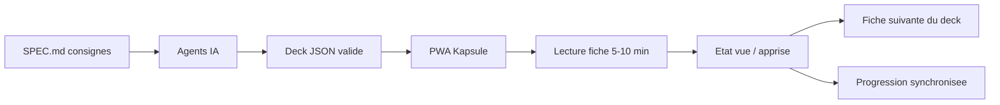

## prod_001_kapsule_product_brief - Kapsule product brief
> Date: 2026-07-17
> Status: Proposed
> Related request: `req_000_cadrer_et_creer_le_mvp_kapsule`
> Related backlog: `item_001_definir_le_schema_de_fiche_et_le_spec_md_pour_agents_ia`, `item_002_creer_le_socle_monorepo_pwa_frontend_et_backend_api`, `item_003_construire_le_lecteur_de_fiches_et_la_navigation_en_deck`, `item_004_suivre_la_progression_et_la_persister_via_le_backend`, `item_005_importer_et_valider_des_decks_generes_par_ia`
> Related task: `task_001_orchestrer_le_mvp_kapsule`
> Related architecture: `adr_001_kapsule_architecture_direction`
> Reminder: Update status, linked refs, scope, decisions, success signals, and open questions when you edit this doc.

# Overview
Kapsule est une visionneuse de fiches de connaissance courtes (5-10 min) organisees en decks, alimentee par un format JSON predefini que des agents IA peuvent produire directement, avec suivi de progression synchronise via un backend leger.

# Goals
- Garantir un rendu d'apprentissage toujours correct grace a un format de fiche ferme et valide.
- Permettre de generer et importer des decks de fiches via des agents IA a partir d'un fichier de consignes SPEC.md.
- Offrir un parcours d'apprentissage fluide : decks, etats des fiches, enchainement vers la fiche suivante.
- Synchroniser la progression entre appareils via un backend des le MVP.
- Etre installable sur Android en PWA sans passer par un store.

# Non-goals
- Application native Android/iOS au MVP.
- Editeur de fiches WYSIWYG integre (la production passe par le format JSON).
- Repetition espacee complete (SM-2) au MVP - prevue en evolution.
- Comptes multi-utilisateurs avec partage social ou classements.
- Generation de fiches IA integree dans l'app (la generation se fait hors app via SPEC.md).

# Scope and guardrails
- In: format de fiche ferme (JSON Schema + SPEC.md), lecteur de fiches, decks avec etats et enchainement, progression persistee via backend, import de decks avec validation, PWA installable.
- Out: appli native, editeur WYSIWYG, repetition espacee, social/partage, generation IA integree a l'app.

# Key product decisions
- Le format JSON predefini est le contrat central entre les agents IA et l'app : types de sections fermes, validation stricte a l'import.
- SPEC.md est a la fois documentation humaine et prompt de generation pour les agents IA.
- Backend leger des le MVP pour eviter les frictions (progression multi-appareils, decks centralises).
- PWA plutot qu'appli native : une seule base de code, installation Android sans store, hors-ligne possible.

# Success signals
- Un deck genere par un agent IA a partir de SPEC.md s'importe et se lit sans aucune retouche.
- Une session d'apprentissage complete (ouvrir un deck, lire une fiche, la marquer apprise, enchainer) tient en moins de 10 minutes.
- La progression est retrouvee intacte apres changement d'appareil.

# References
- Product back-reference: `req_000_cadrer_et_creer_le_mvp_kapsule`
- Task back-reference: `task_001_orchestrer_le_mvp_kapsule`
