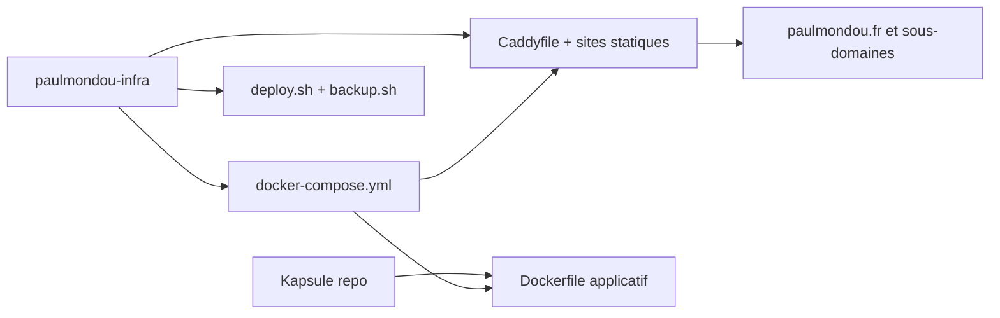

## prod_002_brief_infrastructure_vps_multi_projets_paulmondou_infra - Brief - Infrastructure VPS multi-projets paulmondou-infra
> Date: 2026-07-22
> Status: Settled
> Related request: `req_010_extraire_l_infrastructure_vps_multi_projets_vers_paulmondou_infra`
> Related backlog: `item_015_extraire_le_repo_infra_paulmondou_infra`
> Related task: `task_011_orchestrer_l_extraction_de_l_infra_vps_vers_paulmondou_infra`
> Related architecture: (none yet)
> Reminder: Update status, linked refs, scope, decisions, success signals, and open questions when you edit this doc.

# Overview
Isoler l'orchestration VPS commune dans un repo infra reutilisable par plusieurs projets.

# Goals
- Clarifier la frontiere entre l'application Kapsule et l'infrastructure de production.
- Permettre au VPS d'heberger plusieurs projets sans faire de Kapsule le repo d'autorite de l'infra.
- Rendre les deploiements et sauvegardes comprehensibles depuis un repo dedie.

# Non-goals
- Mettre en place un deploiement automatique depuis GitHub Actions.
- Changer l'architecture runtime Docker/Caddy existante.
- Migrer la base de donnees ou le stockage de Kapsule.

# Scope and guardrails
- In: orchestration VPS, Caddy, sites statiques, scripts d'exploitation,
  sauvegardes, documentation d'environnement et lien vers le checkout Kapsule.
- Out: code applicatif Kapsule, CI/CD automatique, DNS, secrets reels et
  migration runtime.

# Key product decisions
- Kapsule reste le repo applicatif et conserve son `Dockerfile`.
- `paulmondou-infra` devient le repo d'autorite pour Compose, Caddy, portail,
  vitrines statiques, sauvegardes et deploiement VPS multi-projets.
- Le build Compose reference Kapsule par `KAPSULE_APP_DIR`, avec `../Kapsule`
  comme convention locale et serveur.

# Success signals
- Kapsule ne contient plus `deploy/` et documente le repo infra comme point
  d'exploitation.
- `paulmondou-infra` est un repo GitHub pousse avec README, `.gitignore`,
  Compose, Caddy, scripts executables et sites statiques.
- La CI Kapsule reste verte apres extraction.

# References
- Product back-reference: `item_015_extraire_le_repo_infra_paulmondou_infra`
- Task back-reference: `task_011_orchestrer_l_extraction_de_l_infra_vps_vers_paulmondou_infra`
