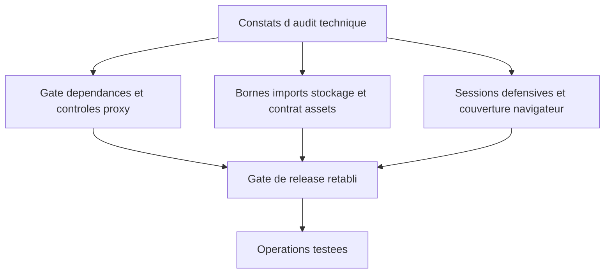

## prod_003_securisation_et_fiabilisation_de_kapsule - Securisation et fiabilisation de Kapsule
> Date: 2026-07-25
> Status: Proposed
> Related request: `req_011_remedier_aux_constats_de_l_audit_technique_2026_07_25`
> Related backlog: `item_016_resoudre_le_gate_dependances_et_les_controles_proxy_d_authentification`, `item_017_borner_imports_stockage_et_contrat_assets_csp`, `item_018_renforcer_sessions_couverture_navigateur_et_operations`
> Related task: `task_012_orchestrer_la_remediation_de_l_audit_kapsule`
> Related architecture: (none yet)
> Reminder: Update status, linked refs, scope, decisions, success signals, and open questions when you edit this doc.
> Indicators reviewed: 2026-08-07

# Overview
Retablir un gate de release, des limites de ressources et des sessions defensives.

# Goals
- Dependances sures
- Anti-abus fiable
- Operations testees

# Non-goals
- Nouvelles fonctions d'apprentissage

# Scope and guardrails
- In: scaffolded request, product, backlog, orchestration task, validation, and handoff context.
- Out: unrelated workflow docs and implementation of generated tasks.

# Key product decisions
- Use structured input as the source of truth for generated docs.
- Keep generated write paths local and repo-bounded.

# Success signals
- Generated docs pass lint and audit without broad manual rewrites.
- Context-pack output can be handed to an implementation agent directly.

# References
- Product back-reference: `req_011_remedier_aux_constats_de_l_audit_technique_2026_07_25`
- Task back-reference: `task_012_orchestrer_la_remediation_de_l_audit_kapsule`
