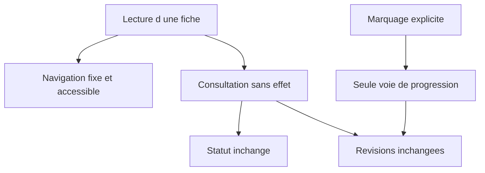

## prod_004_lecture_neutre_et_navigation_persistante_des_fiches - Lecture neutre et navigation persistante des fiches
> Date: 2026-07-30
> Status: Proposed
> Related request: `req_012_rendre_la_lecture_des_fiches_navigable_et_neutre_pour_la_progression`
> Related backlog: `item_019_navigation_persistante_et_lecture_neutre_des_fiches`
> Related task: `task_013_orchestrer_la_lecture_neutre_et_la_navigation_persistante`
> Related architecture: (none yet)
> Reminder: Update status, linked refs, scope, decisions, success signals, and open questions when you edit this doc.
> Indicators reviewed: 2026-08-07

# Overview
Permettre de lire et parcourir librement un deck sans alterer la progression, avec une navigation fixe et accessible.

# Goals
- Rendre les actions de navigation disponibles a tout moment.
- Garantir qu'une consultation est sans effet sur le statut ni les revisions.
- Conserver le marquage explicite comme unique moyen de faire progresser une fiche.

# Non-goals
- Modifier l'algorithme SM-2 ou les intervalles de revision.
- Ajouter une edition manuelle des statuts ou un nouveau mode de quiz.
- Changer la structure ou le contenu des decks.

# Scope and guardrails
- In: scaffolded request, product, backlog, orchestration task, validation, and handoff context.
- Out: unrelated workflow docs and implementation of generated tasks.

# Key product decisions
- Use structured input as the source of truth for generated docs.
- Keep generated write paths local and repo-bounded.

# Success signals
- Generated docs pass lint and audit without broad manual rewrites.
- Context-pack output can be handed to an implementation agent directly.

# References
- Product back-reference: `req_012_rendre_la_lecture_des_fiches_navigable_et_neutre_pour_la_progression`
- Task back-reference: `task_013_orchestrer_la_lecture_neutre_et_la_navigation_persistante`
