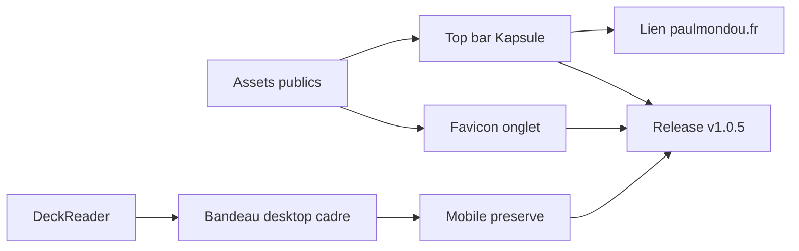

## prod_005_identite_visuelle_et_navigation_de_lecture_kapsule - Identite visuelle et navigation de lecture Kapsule
> Date: 2026-08-04
> Status: Settled
> Related request: `req_013_corriger_le_bandeau_de_lecture_desktop_et_aligner_l_identite_visuelle_kapsule`
> Related backlog: `item_020_corriger_le_bandeau_de_lecture_desktop_sans_regression_mobile`
> Related task: `task_014_orchestrer_correction_bandeau_branding_kapsule_et_release_tagguee`
> Related architecture: (none yet)
> Reminder: Update status, linked refs, scope, decisions, success signals, and open questions when you edit this doc.

# Overview
Aligner le lecteur de fiches desktop et l'identite visuelle du site avec les emblemes Kapsule et Paulmondou, sans regression mobile.

# Goals
- Rendre le bandeau de lecture professionnel et coherent sur desktop.
- Installer les icones Kapsule comme source d'identite du site et de l'onglet.
- Relier clairement Kapsule a son site parent Paulmondou depuis la barre superieure.
- Encadrer la livraison par la politique de release tagguee.

# Non-goals
- Refondre globalement le lecteur de deck au-dela du bandeau concerne.
- Modifier la logique de progression, de revision ou d'authentification.
- Changer le contenu des decks existants.

# Scope and guardrails
- In: scaffolded request, product, backlog, orchestration task, validation, and handoff context.
- Out: unrelated workflow docs and implementation of generated tasks.

# Key product decisions
- Use structured input as the source of truth for generated docs.
- Keep generated write paths local and repo-bounded.

# Success signals
- Generated docs pass lint and audit without broad manual rewrites.
- Context-pack output can be handed to an implementation agent directly.

# References
- Product back-reference: `item_020_corriger_le_bandeau_de_lecture_desktop_sans_regression_mobile`
- Task back-reference: `task_014_orchestrer_correction_bandeau_branding_kapsule_et_release_tagguee`
