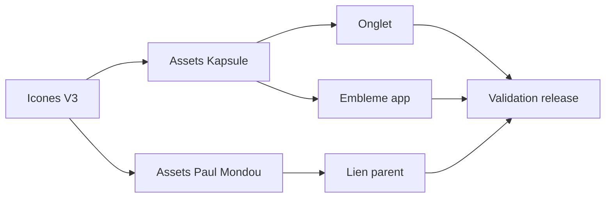

## prod_006_identite_kapsule_alignee_sur_icones_v3 - Identite Kapsule alignee sur Icones V3
> Date: 2026-08-05
> Status: Proposed
> Related request: `req_014_integrer_les_icones_icones_v3_et_le_lien_parent_paul_mondou_dans_kapsule`
> Related backlog: `item_023_remplacer_favicon_et_embleme_kapsule_par_icones_v3`, `item_024_mettre_le_lien_parent_paul_mondou_aux_couleurs_icones_v3`
> Related task: `task_015_orchestrer_l_integration_icones_v3_dans_kapsule`
> Related architecture: (none yet)
> Reminder: Update status, linked refs, scope, decisions, success signals, and open questions when you edit this doc.

# Overview
Kapsule expose les nouvelles icones Icones V3 sur l'onglet, l'embleme applicatif et le lien parent Paul Mondou.

# Goals
- Remplacer les assets de marque visibles par les variantes Icones V3.
- Conserver une navigation parent claire vers Paul Mondou.
- Rendre la livraison reproductible depuis les assets copies dans le repo.

# Non-goals
- Redessiner l'interface Kapsule hors remplacement d'identite.
- Modifier l'authentification, la lecture des decks ou les workflows metier.

# Scope and guardrails
- In: scaffolded request, product, backlog, orchestration task, validation, and handoff context.
- Out: unrelated workflow docs and implementation of generated tasks.

# Key product decisions
- Use structured input as the source of truth for generated docs.
- Keep generated write paths local and repo-bounded.

# Success signals
- Generated docs pass lint and audit without broad manual rewrites.
- Context-pack output can be handed to an implementation agent directly.

# References
- Product back-reference: `req_014_integrer_les_icones_icones_v3_et_le_lien_parent_paul_mondou_dans_kapsule`
- Task back-reference: `task_015_orchestrer_l_integration_icones_v3_dans_kapsule`
