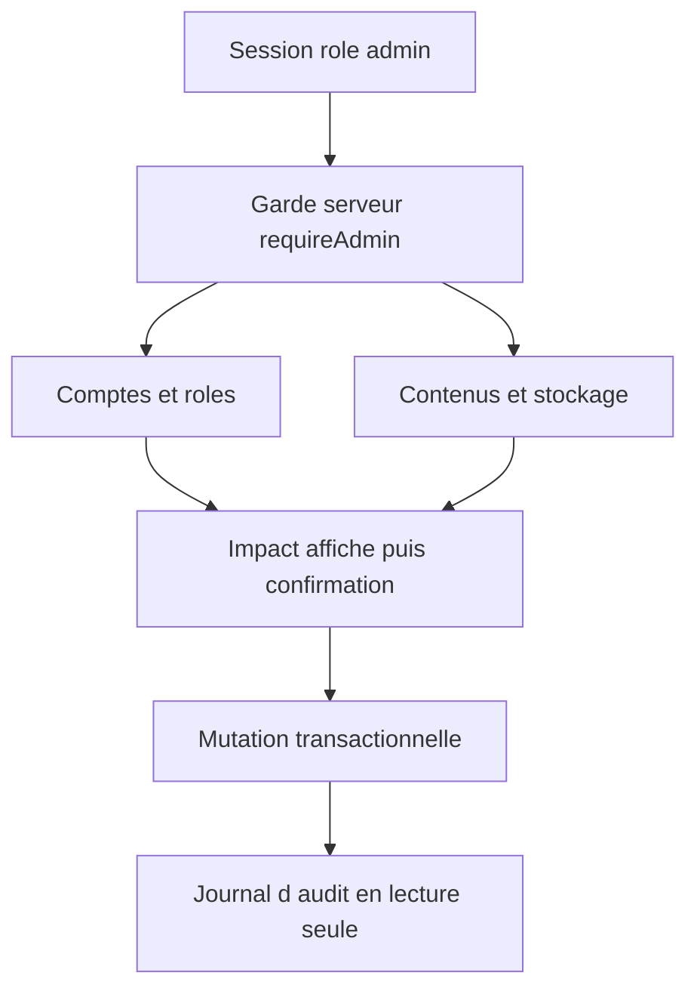

## prod_007_console_d_administration_kapsule - Console d'administration Kapsule
> Date: 2026-08-06
> Status: Settled
> Related request: `req_015_administrer_les_utilisateurs_et_contenus_kapsule`
> Related backlog: `item_025_administrer_les_comptes_et_roles_kapsule`
> Related task: `task_016_orchestrer_la_console_d_administration_kapsule`
> Related architecture: (none yet)
> Reminder: Update status, linked refs, scope, decisions, success signals, and open questions when you edit this doc.

# Overview
Un espace d'administration interne, protege par les sessions et le role admin Kapsule, pour gerer les comptes et contenus de facon explicite, tracable et sans acces SQL direct.

# Goals
- Rendre autonomes les operations courantes sur les utilisateurs, en particulier la gestion des roles guest, master et admin.
- Donner une vision utile des contenus Kapsule et de leur occupation de stockage.
- Rendre les mutations sensibles reversibles autant que possible, confirmees et auditables.
- Conserver le modele de permissions et la surface reseau existants de Kapsule.

# Non-goals
- Construire une console SQL, exposer SQLite, Docker ou le systeme de fichiers sur Internet.
- Administrer ClaimLens, Gnosis ou toute autre application depuis Kapsule.
- Mettre en place un nouveau fournisseur d'identite, un SSO ou une authentification multi-facteur dans cette tranche.
- Modifier directement des champs metier arbitraires sans action, validation et journalisation dediees.

# Scope and guardrails
- In: scaffolded request, product, backlog, orchestration task, validation, and handoff context.
- Out: unrelated workflow docs and implementation of generated tasks.

# Key product decisions
- Use structured input as the source of truth for generated docs.
- Keep generated write paths local and repo-bounded.

# Success signals
- Generated docs pass lint and audit without broad manual rewrites.
- Context-pack output can be handed to an implementation agent directly.

# References
- Product back-reference: `item_025_administrer_les_comptes_et_roles_kapsule`
- Task back-reference: `task_016_orchestrer_la_console_d_administration_kapsule`
