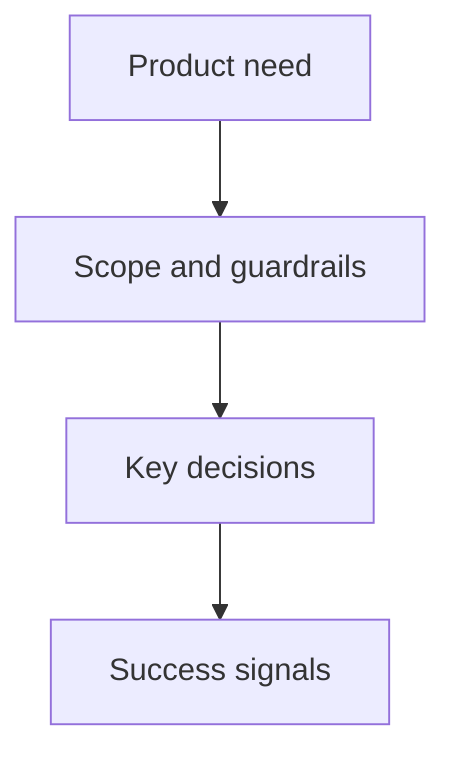

## prod_008_publier_les_derniers_assets_icones_v3_et_ajouter_generer_un_deck - Publier les derniers assets Icones V3 et ajouter Generer un deck
> Date: 2026-08-06
> Status: Proposed
> Related request: `req_016_publier_les_derniers_assets_icones_v3_et_ajouter_generer_un_deck`
> Related backlog: `item_027_publier_les_derniers_assets_icones_v3_et_ajouter_generer_un_deck`
> Related task: (none yet)
> Related architecture: (none yet)
> Reminder: Update status, linked refs, scope, decisions, success signals, and open questions when you edit this doc.

# Overview
- Kapsule utilise ses derniers masters Icones V3 et donne accès au générateur Gnosis directement depuis les actions de création de deck.

# Goals
- (goal to document)

# Non-goals
- (non-goal to document)

# Scope and guardrails
- In: (to document)
- Out: (to document)

# Key product decisions
- (decision to document)

# Success signals
- (success signal to document)

# References
- Product back-reference: `item_027_publier_les_derniers_assets_icones_v3_et_ajouter_generer_un_deck`
- Task back-reference: (none yet)
