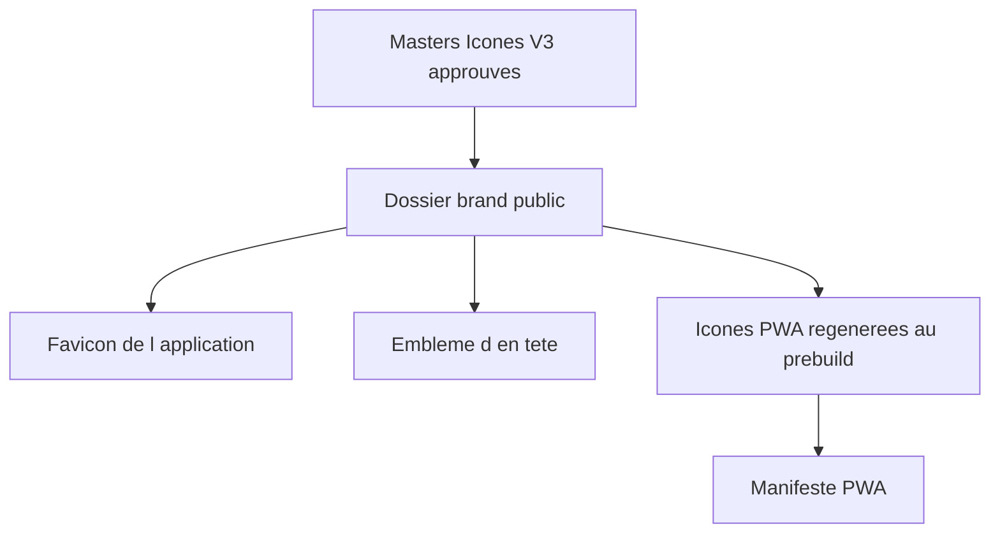

## prod_009_identite_kapsule_alignee_sur_icones_v3_corrige - Identite Kapsule alignee sur Icones V3 corrige
> Date: 2026-08-06
> Status: Settled
> Related request: `req_018_remplacer_les_assets_brand_kapsule_par_les_masters_icones_v3_corriges`
> Related backlog: `item_029_remplacer_les_assets_brand_et_les_icones_pwa_kapsule`
> Related task: `task_019_remplacer_les_assets_brand_kapsule_par_les_masters_icones_v3_corriges`
> Related architecture: (none yet)
> Reminder: Update status, linked refs, scope, decisions, success signals, and open questions when you edit this doc.

# Overview
L'application et son manifeste PWA doivent servir les masters approuves.

# Goals
- Embleme, favicon et icones PWA issus d'une source unique.
- Liens vers Gnosis et Paul Mondou coherents avec leurs masters.

# Non-goals
- Modifier la strategie de theming du frontend.

# Scope and guardrails
- In: scaffolded request, product, backlog, orchestration task, validation, and handoff context.
- Out: unrelated workflow docs and implementation of generated tasks.

# Key product decisions
- Use structured input as the source of truth for generated docs.
- Keep generated write paths local and repo-bounded.

# Success signals
- Generated docs pass lint and audit without broad manual rewrites.
- Context-pack output can be handed to an implementation agent directly.

# References
- Product back-reference: `item_029_remplacer_les_assets_brand_et_les_icones_pwa_kapsule`
- Task back-reference: `task_019_remplacer_les_assets_brand_kapsule_par_les_masters_icones_v3_corriges`
