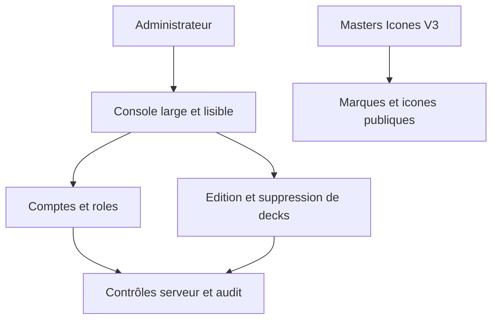

## prod_010_console_d_administration_exploitable_et_identite_icones_v3_complete - Console d'administration exploitable et identite Icones V3 complete
> Date: 2026-08-08
> Status: Settled
> Related request: `req_019_rendre_la_console_d_administration_pleine_largeur_editable_et_alignee_sur_icones_v3`
> Related backlog: `item_031_etendre_et_rendre_lisible_la_console_d_administration`
> Related task: `task_020_orchestrer_la_console_d_administration_large_editable_et_icones_v3`
> Related architecture: (none yet)
> Reminder: Update status, linked refs, scope, decisions, success signals, and open questions when you edit this doc.

# Overview
Une console large, lisible et réellement actionnable, accompagnée d'une identité visuelle servie uniquement depuis les masters Icones V3 pertinents.

# Goals
- Rendre les données administratives lisibles et les opérations courantes réalisables sans SQL.
- Ajouter une édition de deck limitée, sûre et auditée.
- Aligner l'ensemble des marques et icônes visibles avec le lot Icones V3 fourni.

# Non-goals
- Créer un éditeur de cartes, modifier le JSON brut d'un deck ou transférer sa propriété.
- Affaiblir les contrôles serveur, la confirmation de suppression ou la protection du dernier administrateur.
- Introduire dans Kapsule les emblèmes Cantracediag, Claimlens ou F1 Datas, qui ne sont pas aujourd'hui affichés par le site.

# Scope and guardrails
- In: scaffolded request, product, backlog, orchestration task, validation, and handoff context.
- Out: unrelated workflow docs and implementation of generated tasks.

# Key product decisions
- Use structured input as the source of truth for generated docs.
- Keep generated write paths local and repo-bounded.

# Success signals
- Generated docs pass lint and audit without broad manual rewrites.
- Context-pack output can be handed to an implementation agent directly.

# References
- Product back-reference: `item_031_etendre_et_rendre_lisible_la_console_d_administration`
- Task back-reference: `task_020_orchestrer_la_console_d_administration_large_editable_et_icones_v3`
